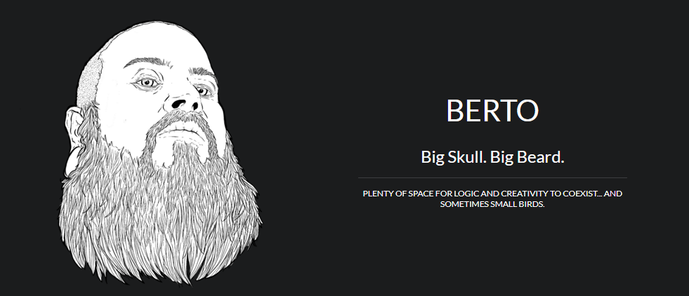
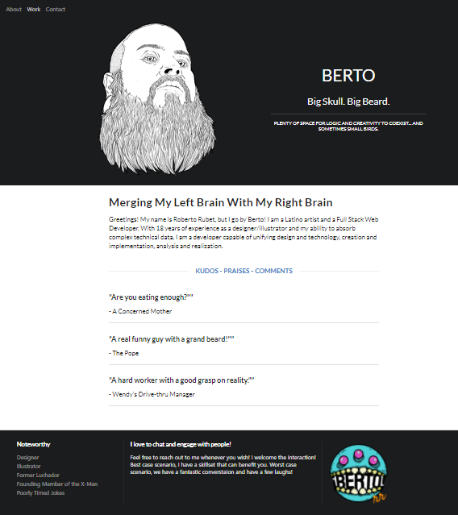

An overhaul of my portfolio featuring my current work. The work page is divided into the left side and the right side. The division represents both halves of the brain. Left = logic & Right = Creativity

## Link
[Berto Portfolio](https://eloquent-einstein-00bf1b.netlify.app/)

## Table of Contents

* [Description](#description)
* [Usage](#usage)
* [Screenshots](#screenshots)
* [Questions](#questions)

## Description

* Portfolio was redesigned to leverage [ReactJS](https://reactjs.org/)
* [React-Bootstrap](https://react-bootstrap.github.io/) and [React Semantic UI](https://react.semantic-ui.com/) were utilized to create the layout
* I created the illustratation of myself - more examples of my artwork `BERTO` (www.robertorubet.com)

## Usage

* When the application is loaded for the first time, the user is met with the `About` page
* There are three areas in the navigation:
    * About
        * Contains a bit of information on the designer
        * Includes an illustrated self-portrait
    * Work
        * A list of six projects
        * Each project has two sides: The logic and The creativity
          * I kept everything related to logic, code, and logistics, on the left side
          * I kept everything related to design and visuals, on the right side
    * Contact
        * Contains my current contact information
        * The left side has links to my updated Github profile, LinkedIn profile, email, resume, and phone number
        * The right side has links to my Instagram and Personal art site

## Screenshots

Screenshot of the page

## Questions

Feel free to get in touch with me if you have any questions or concerns.

Link to my GitHub Profile: [Bertodemus](https://github.com/bertodemus)

Email me at: [roberto@robertorubet.com](roberto@robertorubet.com)

